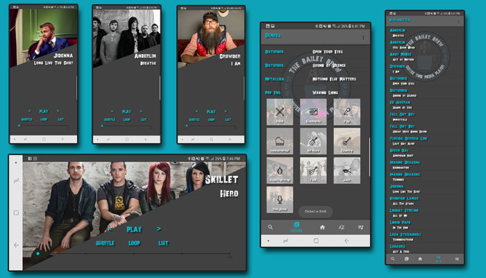

# Bailey Brew Media Player - Music Structure App (Google Scholarship)

This is a music structure app designed as part of Project 4 in the Grow With Google Udacity Program

## Application Features
- 43 songs loaded in with functional mp3
- Genres populated via array creation through for() method and temporary array creation.
- Alphabetical sort populated via Collection.sort() method with comparator.
- Custom Portrait & Landscape layouts for UI design.
- Playlist Creation (coming soon)
- Search music (coming soon)
